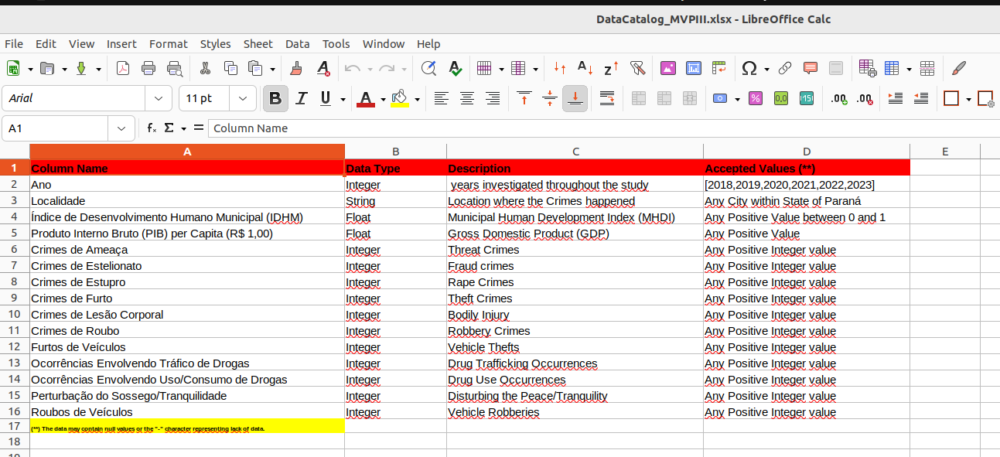
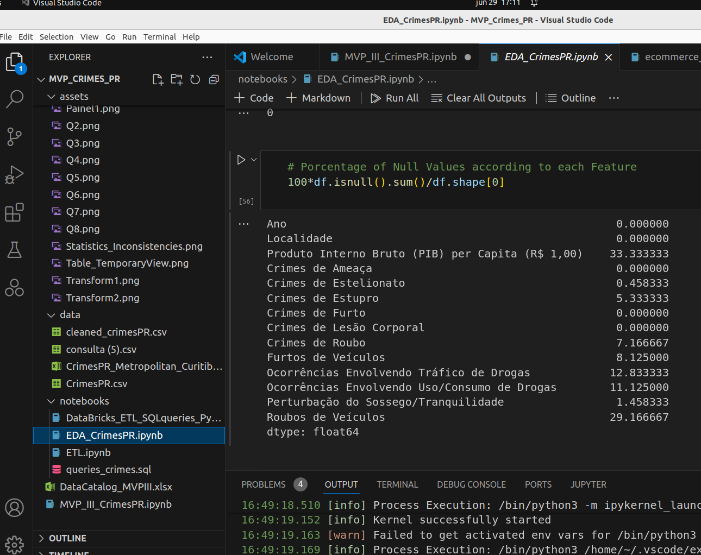
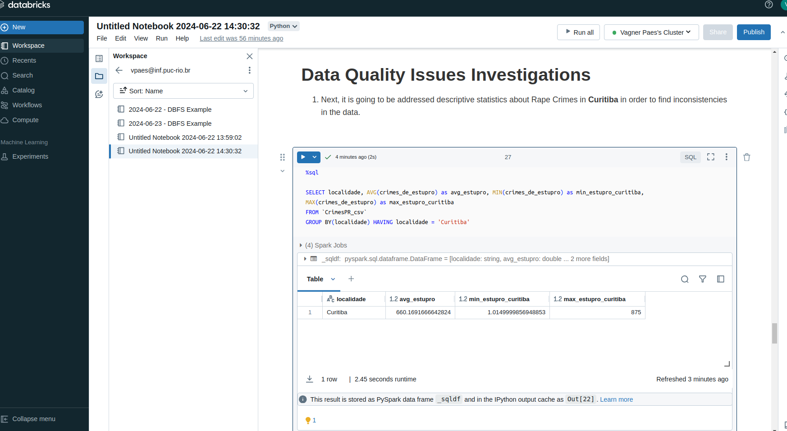

# MVP Data Engineering - Data Science & Analytics Post-Graduation Program of PUC-Rio

## Student: Dr. Vagner Zeizer Carvalho Paes
## Professors:  Tatiana Escovedo, Fernanda Baião, Marcos Villas, Anthony Seabra, Silvio Alonso, and Victor Almeida

### Files and Folders Structures

- ./
    - DataCatalog_MVPIII.xlsx: it contains the Data Catalog of the *Crimes in Paraná* dataset in the *bronze* layer;
    - MVP_III_CrimesPR.ipynb: it contains the ipython notebook summarizing MVP's results;
    - MVP_III_CrimesPR.pdf: the pdf file of the ipython notebook, which summarizes MVP's results.

- ./assets/
    - It contains many figures regarding the screenshots used to evidence the work has been done, as shown and fully documented in the ipython notebook *MVP_III_CrimesPR.ipynb*.

- ./data/
    - cleaned_CrimesPR.csv: it contains "cleaned data" (same as in the *silver* layer) regarding different types of Crimes in the State of Paraná, Brazil, over the 2018-2023 years, which was obtained after cleaning/transforming the data to an appropriate format for subsequent data analysis;
    - CrimesPR.csv: it contains raw data (same as in the *bronze* layer) regarding different types of Crimes in the State of Paraná, Brazil, over the 2018-2023 years;
    - CrimesPR_Metropolitan_Curitiba_statistics.xlsx: it contains descriptive statistics concerning the main municipalities in the metropolitan area of Curitiba.

- ./notebooks/
    - DataBricks_ETL_SQLqueries_PySpark.ipynb: it shows the script used in DataBricks in order to run the full ETL pipeline and perform SQL queries;
    - EDA_CrimesPR.ipynb: it shows a comprehensive Exploratory Data Analysis (*EDA*) procedure in Python;
    - ETL.ipynb: it shows the full Extract Transform and Load (*ETL*) pipeline in Python code;
    - queries_crimes.sql: it shows the queries written in SQL used to answer the business questions defined in the beginning of the project.

## MVP DATA ENGINEERING/PIPELINE - 3rd Sprint of the Data Science and Analytics Post-Graduation Program of PUC-Rio

- Professors: Tatiana Escovedo, Fernanda Baião, Marcos Villas, Anthony Seabra, Silvio Alonso, and Victor Almeida

Student: Dr. Vagner Zeizer Carvalho Paes

### MVP's Title: Crimes's Investigations in Parana over 2018-2023 years

### In this work, it is going to be created a **Data Pipeline** in DataBricks using the free service named **DataBricks Community Edition**. Here, a plain Table will be created and the correspondent *ETL* (Extract, Transform, Load) pipeline is going to be detailed and documented, as shown below. The pipeline was written in PySpark and the *Transformation* part was fully documented in order to get governance over the entire dataset.

### Definition of the Problem

The State of Paraná, in Brazil, has experienced significant variations in *crime rates* over the past years. While some municipalities have seen a decline in crime, others have seen an increase. This raises questions about the factors that contribute to crime rates in different areas of the state. By understanding these relationships, we aim to identify patterns, trends, and potential causal factors that could help in developing targeted crime prevention strategies and socioeconomic policies.

#### Basic Research Questions:

- To what extent do socioeconomic factors, such as the *Municipal Human Development Index (MHDI)* and *Gross Domestic Product (GDP)* per capita, influence crime rates in the State of Paraná, Brazil?

- What are the *most dangerous cities* according to a specific kind of Crime in the State of Paraná?

- *Impact of Drug-Related Crimes*: How do drug-related crimes (trafficking or use/consumption) relate to other types of crimes? Is there a significant overlap or correlation?

### MVP's Goal

- From the collected data, the following questions about Crimes in the State of Paraná along the 2018-2023 years will be addressed:

1. What is the correlation between Crimes, such as Rapes and Thefts, and GDP or MHDI?

2. What are the Top 10 cities in State of Paraná with the highest number of Rape Crimes?

3. What are the Top 10 cities in State of Paraná with the highest number of Robbery Crimes?

4. What are the Top 10 cities in State of Paraná with the highest number of Drug Trafficking Occurrences?

5. What are the Top 10 cities in State of Paraná with the highest number of Vehicle Thefts?

6. What are the Top 10 cities in State of Paraná with the highest Disturbing of Piece/Tranquility?

7. What is the mean Drug Trafficking and Drug use Occurrences in Curitiba? 

8. Concerning the 7-th question, what about specifically in year 2020?

### **1 - Data Search**

The dataset collected to investigate in this work was obtained from this [website](https://www.dados.pr.gov.br/) from government of the State of Paraná, as it will be detailed in the next sections.

#### **1.1 Data License**

The license for this public, that data was made available by the Brazilian government, is the **[Creative Commons Attribution 4.0 International (CC BY 4.0) license](https://creativecommons.org/licenses/by/4.0/deed.en)**. This license allows anyone to reuse, distribute, and modify the data for any purpose, including commercial purposes, as long as they give appropriate credit to the original source.

#### **1.2 -  Data Dictionary**

Information about the dataset features:

    1 -'Ano': years investigated throughout the study;
    2 - 'Localidade': Location where the Crimes happened;
    3 - 'Índice de Desenvolvimento Humano Municipal (IDHM) ': Municipal Human Development Index (MHDI);
    4 -'Produto Interno Bruto (PIB) per Capita (R$ 1,00)': Gross Domestic Product (GDP);
    5 - 'Crimes de Ameaça ': Threat Crimes;
    6 - 'Crimes de Estelionato ': Fraud crimes;
    7 - 'Crimes de Estupro ': Rape Crimes;
    8 - 'Crimes de Furto ': Theft Crimes;
    9 - 'Crimes de Lesão Corporal ': Bodily Injury;
    10 - 'Crimes de Roubo ': Robbery Crimes;
    11 - 'Furtos de Veículos ': Vehicle Thefts;
    12 - 'Ocorrências Envolvendo Tráfico de Drogas ': Drug Trafficking Occurrences;
    13 - 'Ocorrências Envolvendo Uso/Consumo de Drogas ': Drug Use Occurrences;
    14 - 'Perturbação do Sossego/Tranquilidade ': Disturbing the Peace/Tranquility;
    15 - 'Roubos de Veículos ': Vehicle Robberies.

### 2. **Data Gathering**

The dataset was collected from this [web page](https://www.dados.pr.gov.br/), and by clicking on *Base de Dados do Estado (BDEweb)*, being redirected to this [page](http://www.ipardes.gov.br/imp/index.php). Now, it was selected the variables (*"Seleção de Variáveis"*) present in the **Crimes** section and it was chosen the aforementioned features in the previous section (such as 'Ano', rape and theft crimes, and so on). In order to choose the Locations/Municipalities, it was clicked on *Seleção de Localidade*, and selected "State of Paraná" (*Estado do Paraná*) together with all the cities (*Todos os Municípios*) from State of Parana. This dataset comprehends all the cities within the State of Parana, along with the overall quantities for the whole State of Parana, over the 2018-2023 years.

### 3. **Data Modeling**

Once the data was collected, as shown in the previous Section, it was organized as a single table, and therefore the **flat table Model** was utilized. Despite Models like *star* or *snowflake* could be more suitable for querying and analyze structured relational databases, the dataset here is simple, lightweight and flat, showing a flexible structure. The dataset will be imported from the local computer, loaded in *PySpark* and transformed into a cleaned format, and saved as a Table in order to perform queries, answering the eight business questions listed in the beginning of this document. 

#### 3.1 **Data Lineage/Data Catalog**

The file *./DataCatalog_MVPIII.xlsx* contains a description of the features, their domains, containing  expected values for numerical data, and possible categories for categorical data. A printscreen of this Data Catalog is provided below.

### 4. **Load**

In this section, **Screenshots** will be pasted in order to prove that work was really done according to the MVP's criteria.

#### 4.1 Cluster Creation

The figure below shows the DataBricks's cluster being created.

The figure below shows that the DataBricks's cluster was successfully created.

#### 4.2 Table creation

The figure below shows the creation of a Table from the *Crimes Dataset*. The layer containing the dataset at this stage is going to be named as **bronze**, as usual.

#### 4.3 Loading the Dataset

The figure below shows the load of the *Crimes Dataset* in DataBricks by using PySpark.

#### 4.4 Transforming the Dataset

The figure below shows the **Transformation** step of the *Crimes Dataset* in DataBricks by using PySpark programming Language.

The following procedures have been performed in order to perform the data's transformation:

1. Column's names were standardized by putting them them in lower case, stripping whitespaces, and removing hyphens, as well as special characters;
2. Next, all the columns were converted to *float* type, except 'localidade', which is a *string*;
3. Columns related to *'IDHM', 'GDP' and 'roubo de veiculos' were dropped*, since they have a very large number of null values;
4. The DataFrame/RDD was order by 'localidade', and 'ano', since this dataset has a *temporal order*;
5. Next, null values were *imputed by their median values* according to a given municipality ('localidade');
6. *Rows with null values were dropped from the dataset*, since that if they were not imputed in the last step, they lacked all measurements over the 5 years (from 2018 up to 2023) and must be dropped. 

The figure below shows a screenshot, evidencing that the cleaning procedure was successfully applied in this dataset. Now, there is a cleaned dataset ready-to-be-used in further data analysis (see next section). The layer containing this dataset is going to be named, as usually, **silver**.

#### 4.5 Creating a Table (Temporary View)

The figure below shows a screenshot evidencing that the creation of a Table, or rather a *Temporary View*, was successfully performed in DataBricks. In the next section, it is going be performed data analysis on this transformed dataset by using both *SQL* and *Python*.

### 5. Analysis

#### 5.1 Data Analysis

- Below, it is going to be addressed the questions listed in the beginning of the MVP. Screenshots of the SQL queries will be displayed, evidencing the work has been done.

Q1. What is the correlation between Crimes, such as Rapes and Thefts, and GDP or MHDI?
- Correlation Analysis

The figure below shows that, surprisingly, that crimes, in general, have a low correlation with the Cities's GDP, and it was not possible to answer this question concerning *MHDI* feature, because this specific feature was completely absent of data. Additionally, **Crimes** seem to have a medium or high-correlation between each other. It is noteworthy that the *Spearman's scorrelation method* was used here to create the correlation's heatmap plot (see the file **./notebooks/EDA_CrimesPR.ipynb**), since this data is not normally distributed.   

Q2. What are the Top 10 cities in State of Paraná with the highest number of Rape Crimes?

The top 10 cities are shown in the Figure below. The Top 3 are: *Curitiba, Londrina and Ponta Grossa*.

Q3. What are the Top 10 cities in State of Paraná with the highest number of Robbery Crimes?

The top 10 cities are shown in the Figure below. The Top 3 are: *Castro, Cianorte and Pontal do Paraná*.

Q4. What are the Top 10 cities in State of Paraná with the highest number of Drug Trafficking Occurrences?

The top 10 cities are shown in the Figure below. The Top 3 are: *Londrina, Maringá and Cascavel*.

Q5. What are the Top 10 cities in State of Paraná with the highest number of Vehicle Thefts?

The top 10 cities are shown in the Figure below. The Top 3 are: *Maringá, Cascavel and Foz do Iguaçu*.

Q6. What are the Top 10 cities in State of Paraná with the highest Disturbing of Piece/Tranquility?

The top 10 cities are shown in the Figure below. The Top 3 are: *Cascavel, Francisco Beltrão and Londrina*.

Q7. What is the mean Drug Trafficking and Drug use Occurrences in Curitiba? 

According to the query below, the mean Drug Trafficking and Drug use Occurrences in Curitiba are 1.7 and 3.1, respectively.

Q8. Concerning the last question, what about specifically in year 2020?

According to the query below, the Drug Trafficking and Drug use Occurrences in Curitiba in year 2020 was 2.0 and 3.4, respectively.

It is worth empashizing that in the top 10 cities related to a given crime, there are not cities in some of the last questions like *Curitiba, and São José dos Pinhais*, which might be related to a lack of standardization of the measurements in different cities across the State of Paraná, as it will be discussed in the next sections and subsections. So, these results may not be totally true. 

#### 5.2 Data Quality

- There have been found many found *Null* values in the dataset, according to no values assigned or the "-" character, which in the **ETL procedure** have been imputed by the median values grouped by *Location*. Below, it is shown a screenshot showing the percentage of null values presented in the raw data, obtained from Exploratory Data Analysis, or *EDA*, in python, as presented in the file **EDA_CrimesPR.ipynb**.

- Data Quality Issues Investigations

Before addressing specific quality issues, the figure below shows the descriptive statistics of the overall dataset obtained through Exploratory Data Analysis.

1. Next, it is going to be addressed descriptive statistics about Rape Crimes in **Curitiba** in order to find inconsistencies in the data. From this figure, it is noticed that the minimum value is of around 1.0 and the maximum value is of around 875, clearly pointing out to a data standardization issue.

2. Next, it is going to be addressed descriptive statistics about Drug Trafficking Occurrences in **Curitiba** in order to find inconsistencies in the data. Now, the dataset seems ok within Curitiba, but the overall maximum of this feature in the dataset is 944, clearly pointing out to inconsistency/lack of standardization.

3. Next, it is going to be addressed descriptive statistics about Bodily Injuries in **Curitiba** in order to find inconsistencies in the data. The same as item **2.**, with the maximum possible value of around 976.

4. Next, it is going to be addressed descriptive statistics about Bodily Injuries in **São José dos Pinhais** in order to find inconsistencies in the data. The same as item **2.**, with the maximum possible value of around 976. This shows that are many inconsistencies between many cities concerning standardization in the dataset across different cities across the State of Paraná.

5. **More inconsistencies in the dataset are shown in the file named "./data/CrimesPR_Metropolitan_Curitiba_statistics.xlsx"**. This table shows descriptive statistics of a simplified dataset, such as *minimum, maximum, median and mean values* of each Feature for all the main cities in the Metropolitan area of Curitiba, Paraná, Brazil. In order to demonstrate discrepant values, rows with inconsistencies were lightlighted in yellow, while inconsistent values for specific features were highlighted in red.

#### 5.3 Data Quality's Issues Solution Suggestion

- In order to better deal with *Null* values, be represented as lack of values or the "-" character, a more robust data collection procedure is reccommended;
- The data collected is a [**data silo**](https://www.tibco.com/glossary/what-is-a-data-silo), which means that there might be duplicated data, limited data access (this could explain null values), poor data quality (e.g., brutal discrepancies in the values of the same feature for different cities, as well as in the same city for different years, even taking into account population's size) because Features (e.g., *Threat Crimes* or *Rape Crimes*) could have been measured in different scales for different cities. This means that **this dataset lacks a standardization procedure** accross the cities within the State of Paraná, leading to **inconsistencies in the data**, hardening further data interpretation.

Here are summarized several steps and strategies to address and heal data silos:

1. **Identify and Understand the Silos**
Assessment: Identify all data sources and silos within the organization. In the present dataset, there are many inconcistent values of the same feature for a given city and between different cities, even taking population's size into consideration.
Analysis: Understand the type of data each silo contains, how it is stored, and who manages it.
2. **Establish a Data Governance Framework**
Policies and Procedures: Develop and enforce policies for data management, access, and sharing.
Roles and Responsibilities: Assign clear roles and responsibilities for data stewardship and management.
3. **Centralize Data Storage**
Data could be centralized stored in a Data Warehouse or a Data Lake.
*Data Warehouse*: Implement a data warehouse to centralize structured data from different silos.
*Data Lake*: Use a data lake to centralize unstructured and semi-structured data.
4. **Adopt Modern Data Platforms and Technologies**
Cloud Solutions: Leverage cloud-based platforms like DataBricks, AWS, Azure, or Google Cloud for scalable and flexible data storage and integration.
Data Virtualization: Use data virtualization to create a virtual data layer that integrates data from multiple sources without moving it.
5. **Ensure Data Quality and Consistency**
Data Cleaning: Regularly clean and standardize data to ensure accuracy and consistency, as well as search for local outliers and inconsistent values.
6. **Facilitate Cross-Departmental Collaboration**
Communication: Foster a culture of communication and collaboration among departments (in this case, among cities).
Shared Objectives: Align data management objectives with overall business goals to ensure all departments work towards a common purpose. In the present study, collect data aiming to understand the relationship between crimes and socieconomic factors.
7. **Utilize Data Governance Tools and Platforms**
Metadata Management: Use tools to manage metadata and ensure that data is well-documented and easily discoverable.
*Data Catalogs*: Implement data catalogs to help users find and understand the data available across the organization (among different cities).

### Visualizations in Tableau

By using the cleaned DataFrame/RDD (file in **/data/cleaned_crimesPR.csv**), which was obtained after *EDA* (see file **./notebooks/EDA_CrimesPR.ipynb**) and it is sql-ready, insightful visualizations were performed in **[Tableau](https://www.tableau.com/pt-br)**, as shown in the Dashboard below.

Below, there is a brief description of each Figure in the Dashboard:

1. Top-left Figure: it shows the average Rape Crimes, Vehicles Theft, Drug Trafficking Occurrences, and Threat Crimes for different years;

2. Bottom-left Figure:  it shows the average *Rape Crimes*, *Fraud Crimes*, and *Drug Use Occurrences* for each city within the State of Paraná;

3. Figure on the right corner: it shows in tabular form *Rape Crimes*, *Theft Crimes*, *Vehicles Theft*, and *Drug Trafficking Occurrences* for each city within the State of Paraná.

However, these visualizations could not be made publicly available through an *URL*, because **Public Tableau** was used. 

### 6. Self-Evaluation

The following questions were (reasonably) answered:

[Q1] - **"What is the correlation between Crimes, such as Rapes and Thefts, and GDP or MHDI?"**
Ans.: This question could not be fully answered by using this data, since *GDP* and *MHDI* features presented a very large percentual number of *Null* values. *GDP* could be used, despite 30% of null values, in order to investigate its correlation with several types of Crimes, and, surprisingly, only low-level correlations were found. *MHDI* was removed from the dataset, since there is no data for these cities in the given range of years (2018-2023). Therefore, improving the data gathering/collection step would significantly enhance the data analysis and the conclusions/inferences obtained from data analyses;

[Q2-Q8] - These questions concerned statistics about different types of Crimes in the State of Paraná. It was noticed that "big cities" in population, like *Curitiba* or *São José dos Pinhais* were not present in the top 10 cities concerning a given crime, and this could be related to a lack of standardization of the measurements among different cities. This was confirmed in the investigations performed in the *Data Quality* section, which also pointed out that the data is a *data silos*, meaning that there is, among other things, lack of standardization and communication between different systems in the State of Paraná. Addressing and improving these issues would significantly increase the value obtained from this data, and help battle against Crimes for different cities within the State of Paraná.

It is possible to further extend this project by:

1. Adding more exogenous variables in the dataset, such as *Population*. However, the data silos presented in this dataset would harden creating features like "Crimes by 100K Habitants";
2. Creating more insight visualizations and making them publicly available. However, this would imply in costs in the credit card, since a paid service should be used;
3. Increasing the granularity of the "municipality" of this dataset, by addressing crimes by neighboord in a given city. However, more socieconomic variables/features would be necessary to be collected. Again, the data silos presented here would harden these investigations. Therefore, it is mandatory to address and solve these data silos's issues.

## LICENSE

The license for this public, that data was made available by the Brazilian government, is the **[Creative Commons Attribution 4.0 International (CC BY 4.0) license](https://creativecommons.org/licenses/by/4.0/deed.en)**. This license allows anyone to reuse, distribute, and modify the data for any purpose, including commercial purposes, as long as they give appropriate credit to the original source.
